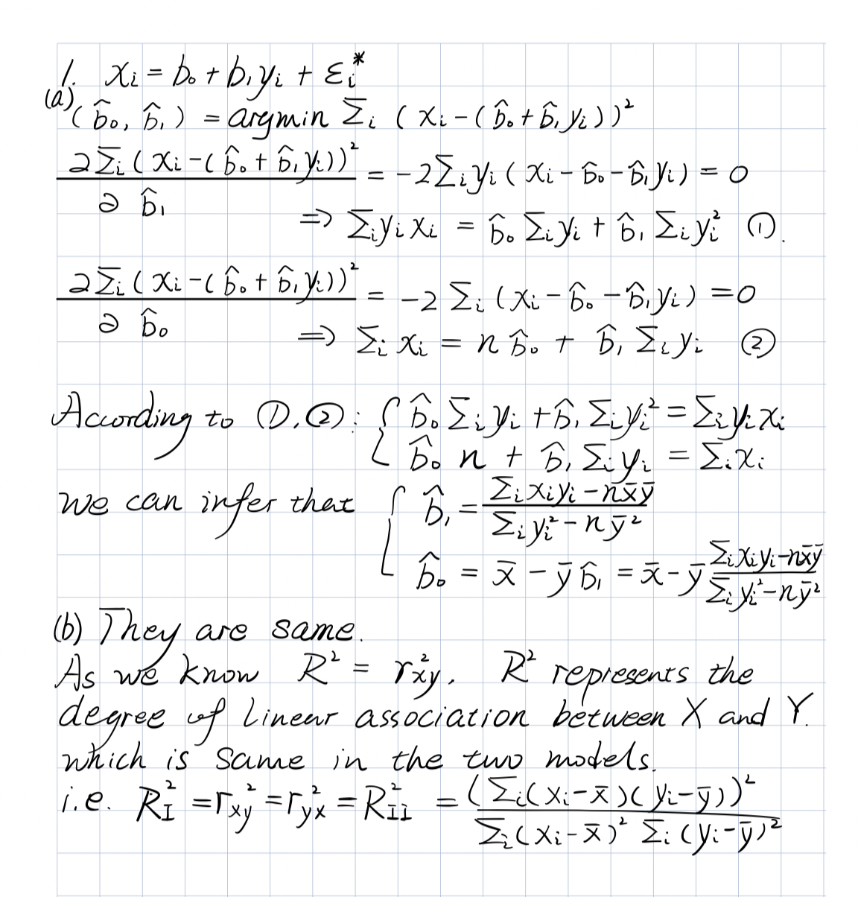

<br><hr><br>

## Part II: HW Questions
<br>

#### 1. SLR Reversed

Consider the Simple Linear Regression model as defined in class: \[y_i = \beta_0 + \beta_1 x_i + \varepsilon_i \qquad \text{ (Model I)}\]
where the $\varepsilon$ random errors have mean zero, are homoscedastic and uncorrelated.

Now, assume that we interchange the response $y_i$ with the predictor $x_i$ and fit the following Simple Linear Regression model: \[x_i = b_0 + b_1 y_i + \varepsilon^*_i \qquad\text{(Model II)}\]
where  the $\varepsilon^*$ random errors have mean zero, are homoscedastic and uncorrelated.

<ol type="a">
<li> <b>Derive</b> (i.e. show your work step-by-step) the Least-Squares estimators for $b_0$ and $b_1$.


</li>


<li>   Let $R^2_I$ be the $R^2$ of model I and $R^2_{II}$ the $R^2$ of model II. Are they the same or not? Discuss.


<font color="blue">

</font>


</li>

</ol>


<br><br>


#### 2. Stat Grades

The `StatGrades.csv`  data set  contains 4 `Quiz Scores` and a `Final Exam` score from an Introductory Statistics course (actual course I taught several years ago!).  Our goal in this example is to investigate if the <b>average</b> of the `Quizzes` can be used to explain the variation in the `Final Exam`  scores by fitting a linear regression model of the `Final Exam `score vs. the `Average Quiz` score.


<ol type="a">

<li> Compute the new variable `Quiz Average` and add it to the data frame.</li>

```{r}
Grades<-read.csv("StatGrades.csv",header=TRUE)
Grades$QuizAverage<-(Grades$quiz1+Grades$quiz2+Grades$quiz3+Grades$quiz4)/4
head(Grades)
```


<li> Obtain the estimated regression line.</li>
```{r}
slr.fit<-lm(final~QuizAverage,data=Grades)
summary(slr.fit)
```
$$\hat{final}=3.94717+0.85667QuizAverage$$

<li>Plot the estimated regression function and the data. How well does the estimated regression function fit the data?</li>
```{r}
library(ggplot2)
ggplot(Grades,aes(QuizAverage,final))+geom_point()+geom_smooth(method=lm)
```
Not really good, there are still many variation of the data about the estimated regression line. 

<li> Interpret $\hat{\beta}_0$ in your estimated regression function. Does $\hat{\beta}_0$ provide any relevant information here? Explain.</li>
```{r}
grade.coef=summary(slr.fit)$coef
grade.coef[1,1]
```

$$\hat{\beta}_0=3.947172$$
No, it doesn't provide any information here because there are no students whose QuizAverage is 0.

<li> Obtain a point estimate of the mean `Final Exam` score  for a student with `Quiz Average`  equal to 60.</li>
```{r}
predict(slr.fit, newdata = data.frame(QuizAverage=60))
```

<li> Estimate the difference in the mean `Final Exam` score for two students whose `Quiz Average`  differs by 1. Use a 90\% confidence interval. </li>
```{r}
confint(slr.fit, 'QuizAverage', level=0.9)
```

<li> Obtain a 90\% confidence interval for the mean `Final Exam` score for students with `Quiz Average`  equal to 85.</li>
```{r}
predict(slr.fit,newdata = data.frame(QuizAverage=85), interval = 'confidence', level=0.9)
```


<li> Obtain a 90\% prediction interval for the mean `Final Exam` score for  a new student with `Quiz Average` equal to 85. Is your prediction interval wider than the corresponding confidence interval? Should it be?</li>
```{r}
predict(slr.fit,newdata = data.frame(QuizAverage=85), interval = 'prediction', level=0.9)
```
Prediction interval is wider. It should be wider.

<li> Conduct an $F$ test to determine whether or not there is a linear association between `Final Exam` score and `Quiz Average`. Use $\alpha$ equal to 0.1. State the alternatives, decision rule and conclusion.</li>
$$
\left\{\begin{array}{l}
H_{0}: \beta_{1}=0\ (null)\\
H_{\alpha}: \beta_{1} \neq 0\ (alternative)
\end{array}\right.
$$
```{r}
grade.anova=anova(slr.fit)
grade.anova
```
Let's compute the p-value. If p-value<$\alpha$ we reject null.
```{r}
pf(grade.anova[1,4],df1=1,df2=380,lower.tail = FALSE)
```
The p-value $9.84919e-64<\alpha=0.1$, so we can conclude that we reject the null: $\beta_{1}=0$, there is a linear association between `Final Exam` score and `Quiz Average`. 

<li> By how much relatively is the total variation in the `Final Exam` score reduced when the `Quiz Average`  is introduced into the analysis? Is this a relatively small or large reduction? What is the name of this measure?</li>
```{r}
summary(slr.fit)$r.square
```
$$R^2=0.5268859$$
0.5268859 of total variation in the `Final Exam` score reduced when the `Quiz Average`  is introduced into the analysis.
It is a relatively large reduction.
The measure names Coefficient of Determination($R-square$).

<li> Calculate $r$ (the correlation coefficient) and attach the appropriate sign.</li>
```{r}
sqrt(summary(slr.fit)$r.square)
```
The sign is positive.
$$r=+|r|=+\sqrt{R^2}=+0.7258691$$

</ol>

