## Introduction
In this case study, we focus on the red wine data set. There are ten independent variables and one dependent variable.
The ten independent variables are: fixed acidity (It is the most acids involved with wine or fixed or nonvolatile),
volatile acidity (It is the amount of acetic acid in wine, which at too high of levels
can lead to an unpleasant, vinegar taste), citric acid (it is an organic compound),
residual sugar (it is  the natural grape sugars left over in a wine after the alcoholic
fermentation is complete), chlorides (it is a compound of chlorine),
free sulfur dioxide (it is the sulfur dioxide that not reacted),
total sulfur dioxide (it is the total amount of sulfur dioxide),
density (it is mass divided by volume),
pH (it is a measurement of hydroge),
sulphates (a salt or ester of sulfuric acid). 
The one dependent variable is alcohol level. 

The goal of our case study is to fit a model that best describes the relationship
between the alcohol (which is the dependent variable) and physiochemical information (which are independent variables).

## Regression Analysis

The goal of our regression analysis is to fit a linear model to predict the response
variable \textbf{alcohol} from the remaining ten predictors. We began this analysis
by reviewing the [\underline{Correlation Matrix}][Correlation Matrix] between the ten predictors and ran a full model
containing all ten physiochemical information predictors. We observed that
there is some correlation between \textbf{fixed.acidity} and \textbf{citric.acid} (0.67),
 \textbf{fixed.acidity} and \textbf{density} (0.67), \textbf{fixed.acidity} and \textbf{pH} (-0.68),
 \textbf{total.sulfur.dioxide} and \textbf{free.sulfur.dioxide} (0.67).
 
 The [\underline{Full Model Regression Result}][Full Regression Model Summary] shows that nine predictor variables are
 statistically significant and one predictor (\textbf{free.sulfur.dioxide}) is not.
 The $R^2$ value of this model is 0.668, which could be interpreted that
 approximately 66.8 percent of the variance in the response variable is explained
 by the model.
 
Because collinearity was detected by our review of the correlation matrix and 
\textbf{free.sulfur.dioxide} is not a significant predictor in the full model, we considered
removing \textbf{free.sulfur.dioxide} first, and potentially we could also remove
other predictors such as \textbf{fixed.acidity} and \textbf{citric.acid} from the model.

 <!-- Yuan: could you please help insert the reduced model regression result in the
 appendix?? -->
Removing \textbf{free.sulfur.dioxide} from the predictors produced a new model
with the same $R^2$. All predictors are statistically significant and
the p-value of \textbf{total.sulfur.dioxide} also decreased significantly, suggesting
that this is an improved model compared to the first regression model. See
[\underline{Reduced Model}][Reduced Model Without Collinearity] for the full summary.

We confirmed this by running a partial F-test to compare two models. Our null
hypothesis is that the reduced model is adequate (or the partial slope of
\textbf{free.sulfur.dioxide} is 0) and the alternative hypothesis is that
the full model is required (the partial slope of \textbf{free.sulfur.dioxide} is not 0).
The p-value of this partial F-test is greater than 0.05, so we fail to reject
the null hypothesis. Therefore, we have evidence that the reduced model is preferred
to the full model and we can drop \textbf{free.sulfur.dioxide}.

We confirmed that no collinearity is present in the current model by calculating the condition
number (~5.26 < 30).

## Diagnostics and Remedial Measures

We ran several diagnostic checks to verify outliers, high leverage points, and 
highly influential points, as well as our model assumptions.

To detect unusual observations, we combined graphical and numerical tools
for the diagnostics. We tried to find observations with leverages more than 2p/n
where p is the number of predictors plus 1 and n is the number of observations.
We found a number of high leverage points. We applied the outliers test using
studentized residuals and found no outliers. Finally, we checked for highly influential
points using the Cook's distance and because the maximum Cook's distance is 0.07,
we can conclude that there is no highly influential points. Although there are no high influential points
based on the rule-of-thumb of the Cook's distance, there are two observations
where the Cook’s distance are much larger than that in other observations. See
[\underline{Detecting Unusual Observation Plots}][Detecting Unusual Observation Plots] to review the plots that checked
for high leverage and highly influential points.

By plotting the residuals vs. fitted values of the current model and running
the studentized Breusch-Pagan test, we found that the assumption of constant error
variance is violated. We also checked for normality by plotting a normal Q-Q plot, a
histogram of residuals, and running a Kolmogorov-Smirnov test. Even though
the histogram of residuals does not show a skewed distribution of residuals,
the Kolmogorov-Smirnov test result suggested that the assumption of normality of errors
does not hold. See [\underline{Checking Model Assumptions}][Checking Model Assumptions] to view these
results in more detail.

 <!-- Yuan: could you please help insert the box cox regression result in the
 appendix and reference here?? -->
Because our response variable contains only positive values, Box-Cox transformation
is a possible remedy to violations of assumptions. The lambda value found by
the Box-Cox method is -1.53 (see [\underline{Box-Cox Lambda}][Box-Cox Lambda]),
so we transformed the response variable by applying
the following function to the response variable. 
$$
g(\textbf{y}) = \frac{y_i^{\lambda} - 1}{\lambda}
$$
and reran the regression model as model_bx. All predictors are found
to be statistically significant and the $R^2$ value is 0.649.

We checked the unusual observations and assumptions again by using a combination of
graphical and numerical tools like before and found that we have high leverage observations, 
no outliers, and no highly influential observations. By the studentized Breusch-Pagan test,
we found that homoscedasticity still does not hold and by the Kolmogorov-Smirnov
test we found that normality also still does not hold.

We checked for non-linearity by plotting nine added-variable plots, one for
each predictor variable. All variables look fine except for residual.sugar because
here the points do not look like they scatter around the fitted line, so
we decided to transform it to log(residual.sugar). (See [\underline{Added-Variable Plot for Residual.Sugar}][Added-Variable Plot for Residual.Sugar]) for more detail. After the transformation, the added-variable plot for
residual-sugar looks much better.

Based on the non-linearity diagnostic, we took the logs of both the residual.sugar variable
and the response variable and re-ran the multivariate linear regression. This modelN
has a higher $R^2$ value compared to previous models (0.71) but the volatile.acidity
variable's p value increased.  See [\underline{Log-Transformed Model Result}][Log-Transformed Model] for more
detail.

We decided to remove volatile.acidity even though it is still a significant
predictor at alpha 0.05, but it is not at lower significance levels. ModelN2
is the model without volatile.acidity and the $R^2$ value is 0.70. We
re-ran the diagnostic checks and found some high leverage points, one outlier, and
no highly influential points. By the studentized Breusch-Pagan test,
we found that homoscedasticity still does not hold and by the Kolmogorov-Smirnov
test we found that normality also still does not hold.

Finally, we tried to apply Generalized Least Squares regression, keeping the log transformations
applied earlier to see if we could fix the violations of assumptions. All predictor variables are statistically
significant at the lowest significance level reported in R and
the $R^2$ value increased to 0.76, or approximately 76% of variance
in the response variable can be explained by the model. This is an improvement
compared to our previous models. See [\underline{GLS Result}][GLS Model] for more
detail.

We re-ran the diagnostic checks again and we found some high leverage points,
no outliers, and no highly influential points. By the studentized Breusch-Pagan test,
we found that homoscedasticity still does not hold and by the Kolmogorov-Smirnov
test we found that normality also still does not hold. Despite being unable
to find a model that satisfies these assumptions, by measure of fit, generalized
least square regression gave us a better model relative to other methods. It is
possible that more advanced techniques need to be used to handle violations
of model assumptions.

## Conclusion
In conclusion, we found a nicely fitted model for the red wine data set.
By eliminating two independent variables, doing diagnostic checks, and then applying
the Generalized Least Square Regression, we successfully built our regression model.
There are eight independent variables in the regression model and they are: fixed acidity,
 citric acid, residual sugar (transformed to log), chlorides,
total sulfur dioxide,density, pH, and sulphates.
In this Generalized From the model, we can conclude that these eight independent variables are statistically
significant in predicting the alcohol level in a multivariate linear model. By checking the diagnostics,
we found no outliers, no highly influential points, and some high leverage points
which are likely to be harmless as they are neither outliers nor highly influential points.
Despite the persisting violations of assumptions, by measure of fit, generalized
least square regression gave us a better model relative to other methods.

## Appendix

### Correlation Matrix
```{r echo=FALSE}
library(knitr)
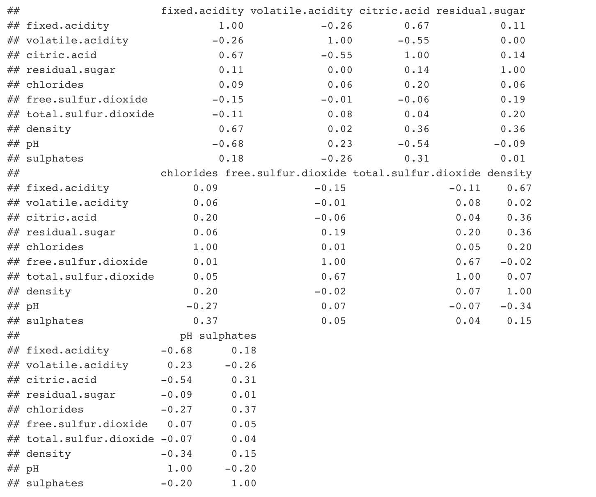
```

### Full Regression Model Summary
```{r echo=FALSE}
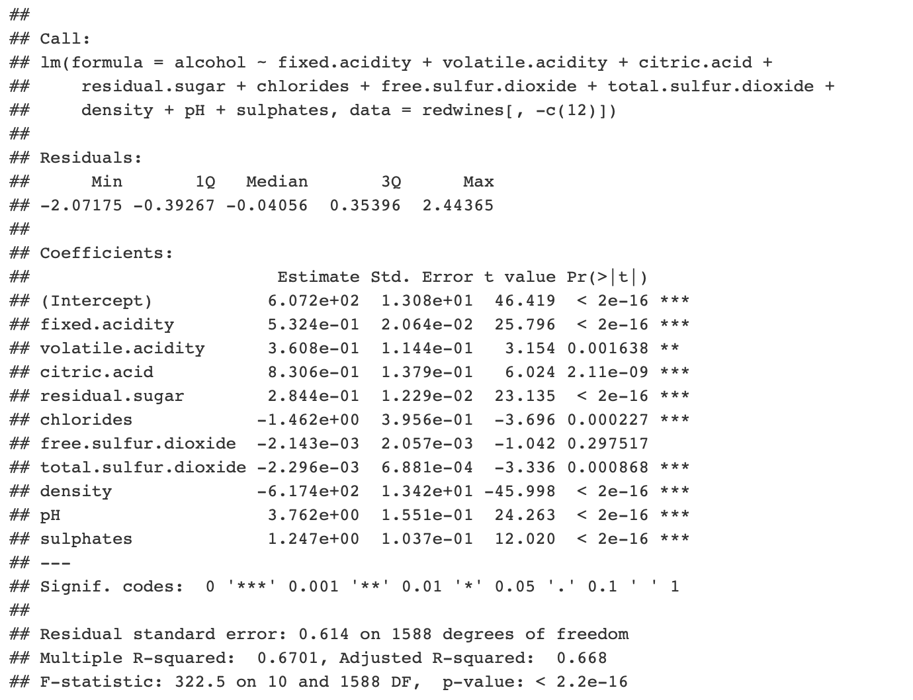
```

### Reduced Model Without Collinearity
```{r echo=FALSE}
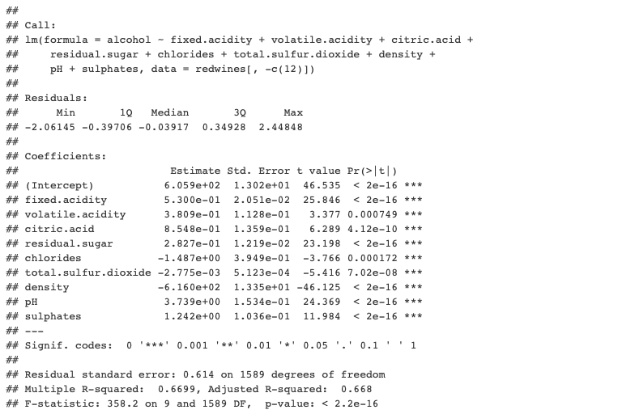
```

### Detecting Unusual Observation Plots
```{r echo=FALSE}
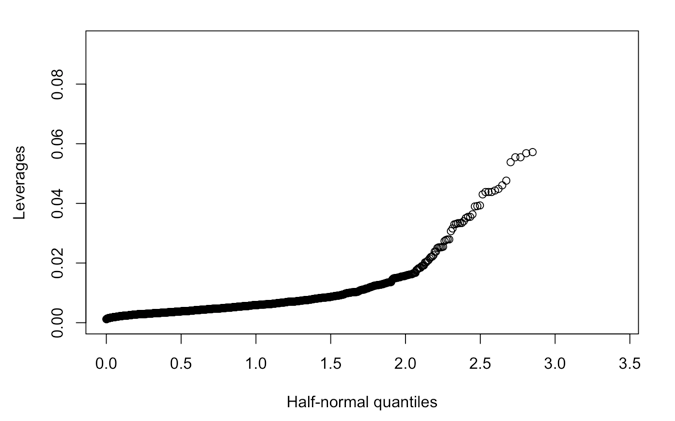
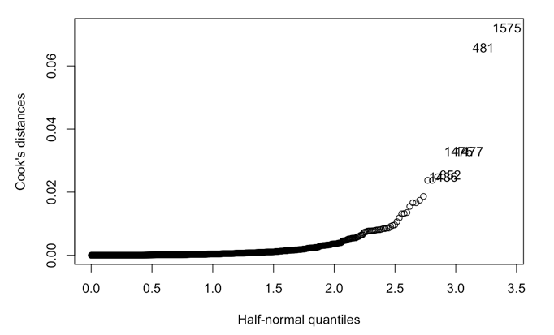
```

### Checking Model Assumptions
```{r echo=FALSE}
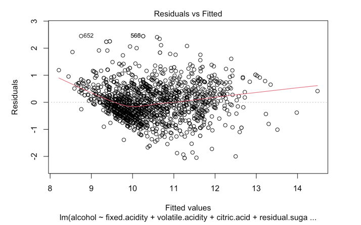
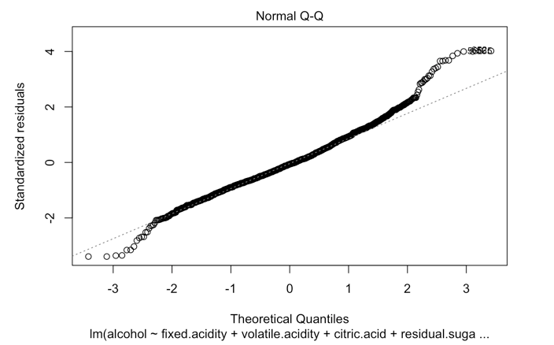
```

### Box-Cox Lambda
```{r echo=FALSE}
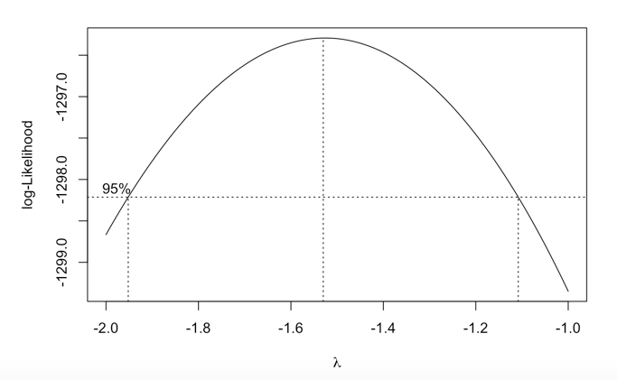
```

### Added-Variable Plot for Residual.Sugar
```{r echo=FALSE}
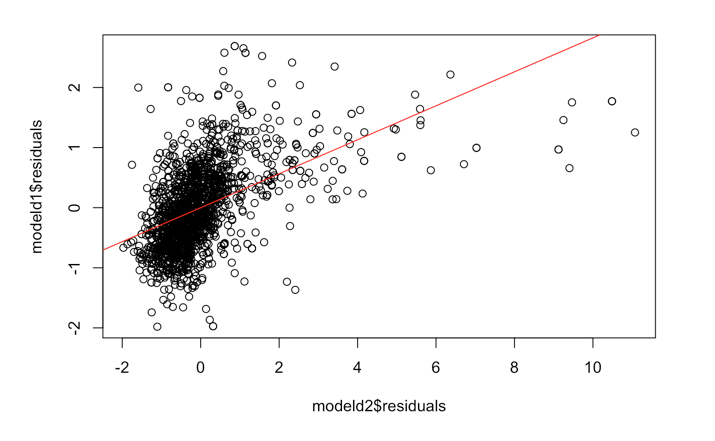
```

### Log-Transformed Model
```{r echo=FALSE}
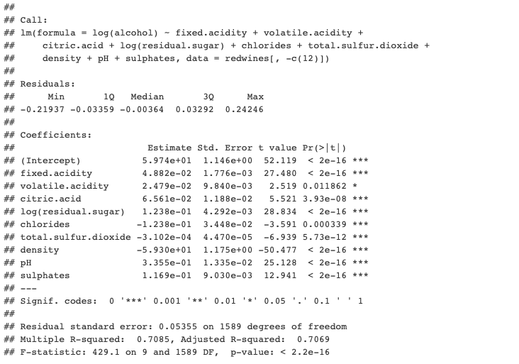
```


### GLS Model
```{r echo=FALSE}
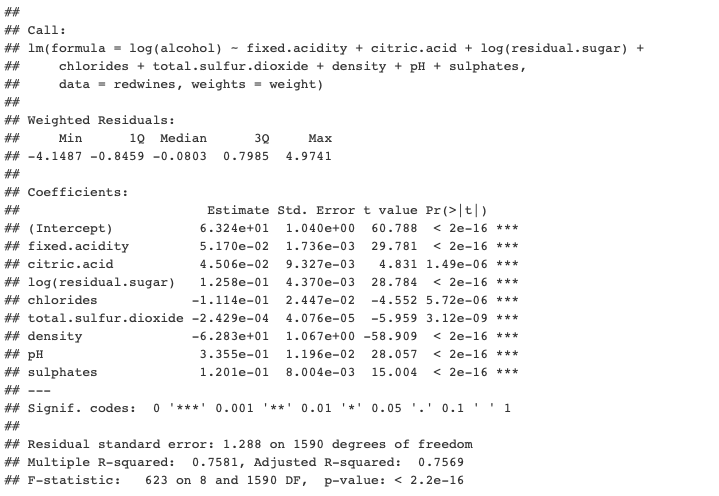
```